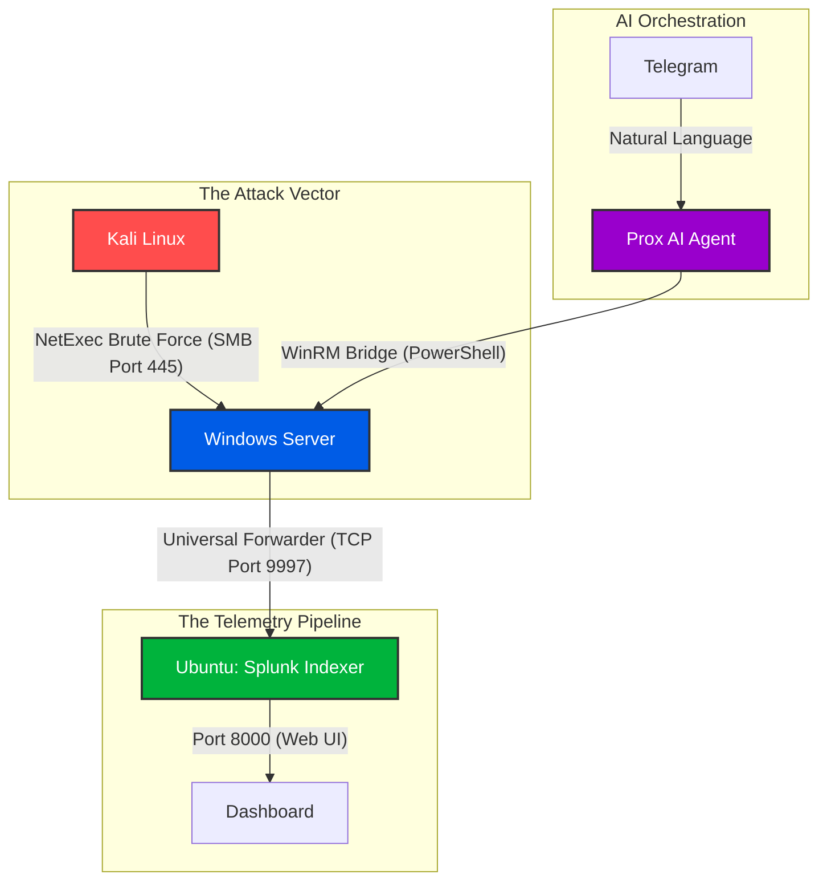

# Agentic-Threat-Hunting-Lab | Splunk & SOAR

## Project Overview
Designed and deployed an isolated threat hunting lab within a Proxmox hypervisor, integrated with a custom AI orchestrator (OpenClaw) for out of band management. Simulated a modern Active Directory SMB brute force attack using Kali Linux (NetExec), and successfully captured, routed, and visualized the attack telemetry in a self hosted Splunk Enterprise SIEM.

## Architecture

## The Methodology
Provisioned an Ubuntu VM, bypassed root execution with a dedicated splunk service account, and deployed Splunk Enterprise.

I Installed the Splunk Universal Forwarder onto the target Windows Server to scrape local Event Viewer logs
Then, I leveraged "Prox," a custom AI agent bridged through Telegram, to perform out of band management via WinRM

- Spun up a Kali Linux node and utilized NetExec (CrackMapExec) to launch a rapid fire dictionary attack against the Windows Server's SMB port

## Challenges & Solutions
- The Silent Sensor issue: The Universal Forwarder successfully completed the TCP handshake, but no data routed to Splunk. Prox diagnosed that the GUI installer failed to write the local inputs. I commanded Prox to inject a PowerShell script, hardcoding the inputs.conf file to read Security, System, and Application logs, instantly fixing the data flow

- Outdated Attack Tooling: The initial attack utilizing Hydra failed to generate logs because modern Windows Server aggressively drops outdated SMB protocol handshakes. Pivoted to NetExec, a modern post exploitation tool that speaks native SMB, successfully forcing the Windows Server to log the Event ID 4625 authentication failures

- Data Normalization: Splunk returned NULL when searching for standard fields like src_ip. Bypassed CIM limitations by adapting the SPL query to target raw Microsoft fields (Source_Network_Address and Account_Name) to properly render visualizations.
